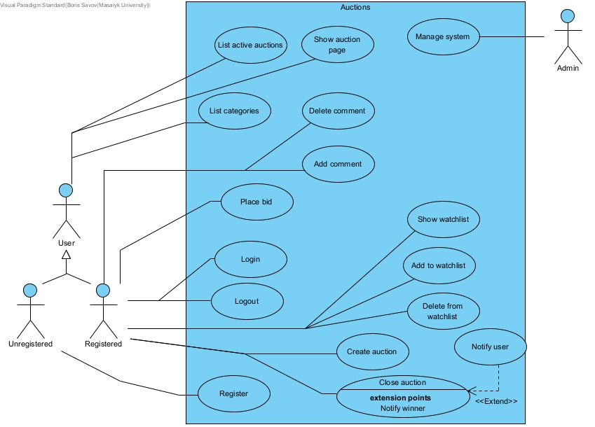
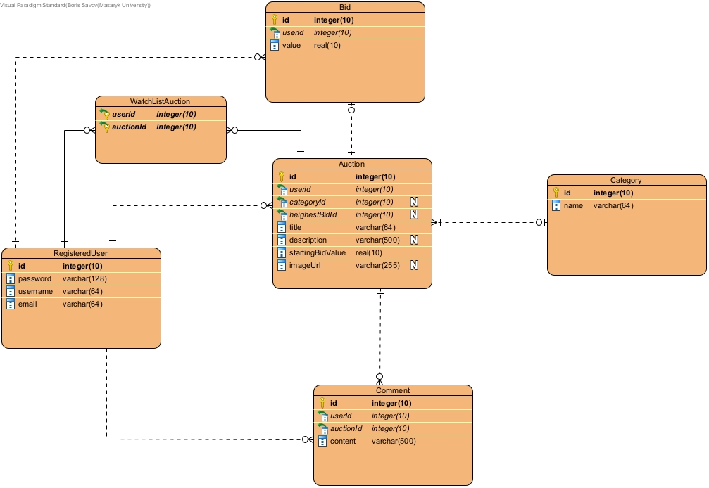

# Auctions
This is a web application for simulating Auctions with Django framework. I created this app as my project while completing Harvard courses
[CS50x](https://www.edx.org/course/introduction-computer-science-harvardx-cs50x) and [CS50w](https://www.edx.org/course/cs50s-web-programming-with-python-and-javascript).

## Technologies
- Python
- Django
- Bootstrap
- HTML
- Sqlite3

## Use Case Diagram

## Entity Relational Diagram

